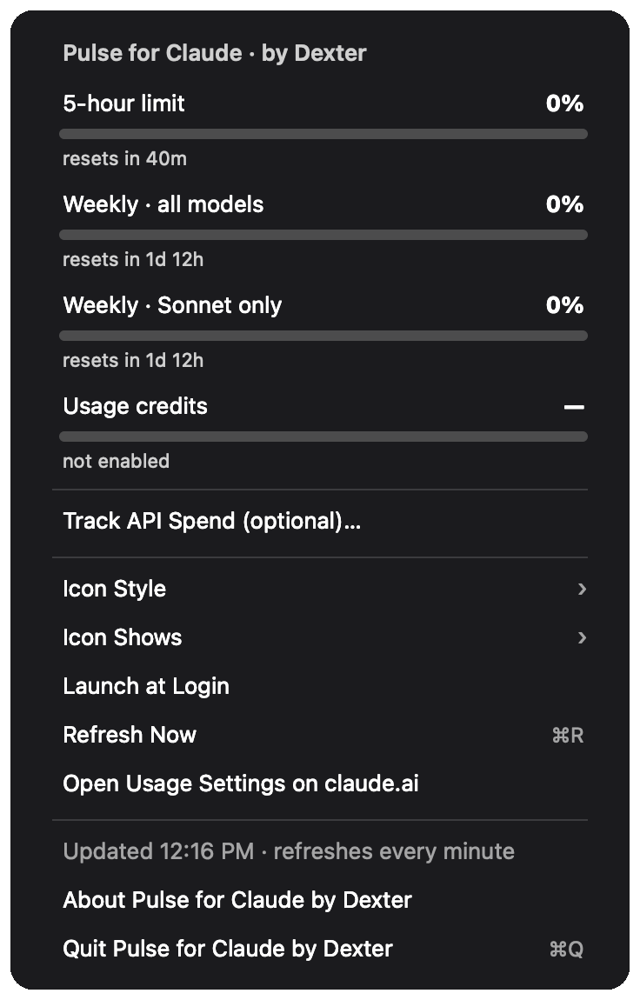

# Pulse for Claude · by Dexter

A tiny, native **macOS menu-bar app** that keeps your Claude usage limits one
glance away — the same numbers `/usage` shows inside Claude Code, live in your
menu bar and refreshed every minute.

Install with `brew`, download the prebuilt app, or **build it yourself** in one
command — `swiftc` turns a single Swift file into a real `.app`.

<p align="center"></p>

---

## What it shows

In the **menu bar**: a small green ring gauge + a percentage (your 5-hour usage
by default).

Click it for the full **drop-down**:

| Row | Meaning |
|---|---|
| **5-hour limit** | Your rolling 5-hour session quota, % used + reset countdown |
| **Weekly · all models** | The 7-day quota across all models |
| **Weekly · Opus only** | 7-day Opus quota — *shown only if your plan has one* |
| **Weekly · Sonnet only** | 7-day Sonnet quota |
| **Usage credits** | Pay-as-you-go extra usage when enabled (real `$used of $limit`); otherwise `not enabled` |

Bars are colour-coded: **green** under 50%, **amber** 50–79%, **red** 80%+.

---

## Install

### Option A — Homebrew (easiest)

```bash
brew install aeron7/tap/pulse-for-claude
```

### Option B — Download the app

Grab the latest zip from [**Releases**](https://github.com/aeron7/pulse-for-claude/releases),
unzip it, and move `Pulse.app` to `/Applications`.

### Option C — Build it yourself

Needs the Swift toolchain (`xcode-select --install` if you don't have Xcode):

```bash
git clone https://github.com/aeron7/pulse-for-claude.git
cd pulse-for-claude
./build.command          # or double-click build.command in Finder
```

That compiles `Pulse.swift` → `Pulse.app`, ad-hoc code-signs it, and launches it.

> **First launch (Options A & B):** the app is ad-hoc signed, not notarized, so
> macOS Gatekeeper warns the first time. Right-click `Pulse.app` → **Open**, or
> run `xattr -dr com.apple.quarantine /Applications/Pulse.app`. Then look at the
> **top-right of your menu bar**.

- **Keep it around:** drag `Pulse.app` into `/Applications`.
- **Rebuild after editing the source:** run `./build.command` again.

---

## How to control it

Everything is driven from the menu you get by **clicking the menu-bar item**.

### Icon Style ▸
Choose what the menu-bar item looks like:
- **Ring** *(default)* — a circular gauge that fills as usage rises, plus the %.
- **Dot** — a coloured dot (green/amber/red) + the %.
- **Number only** — just the percentage, no graphic.

### Icon Shows ▸
Choose which number the menu-bar item reflects:
- **5-hour limit** *(default)* — your session quota.
- **Weekly · all models** — your 7-day quota.

Both choices are remembered between launches (stored in `UserDefaults`).

### Launch at Login
Toggles whether Pulse starts automatically when you log in (uses Apple's
`SMAppService`). A checkmark shows when it's on.
> If you **move `Pulse.app`** (e.g. into `/Applications`) after enabling this,
> toggle it **off and on once** so the login item points at the new location.

### Refresh Now  (⌘R)
Forces an immediate re-fetch instead of waiting for the next minute. The
**Updated h:mm AM/PM · refreshes every minute** line shows the last refresh time.

### Open Usage Settings on claude.ai
Opens <https://claude.ai/settings/usage> in your browser.

### Track API Spend (optional)…
Opens the Anthropic Console usage page
(<https://console.anthropic.com/settings/usage>) for pay-as-you-go API spend.

### About Pulse for Claude by Dexter
Standard macOS About panel (version + credits).

### Quit Pulse for Claude by Dexter  (⌘Q)
Quits the app.

> ⌘R and ⌘Q are **menu shortcuts** — they fire while the Pulse menu is open.

---

## How it works

Pulse reads your **local Claude Code OAuth token** — first from
`~/.claude/.credentials.json`, falling back to the login Keychain item
`Claude Code-credentials` — and calls the same undocumented endpoint Claude Code
itself uses:

```
GET https://api.anthropic.com/api/oauth/usage
Authorization: Bearer <your token>
anthropic-beta: oauth-2025-04-20
```

The response is parsed into the rows above. **Nothing leaves your Mac** except
that one request to `api.anthropic.com`. There is no telemetry, no account, no
server of ours in the middle.

It refreshes every 60 seconds and whenever you choose **Refresh Now**.

---

## Privacy & safety

- Your token is read locally and sent **only** to `api.anthropic.com`.
- No analytics, no network calls anywhere else.
- The app is sandbox-free but does nothing on disk beyond reading your existing
  Claude credentials and saving two small preferences.

---

## Troubleshooting

| Symptom | Fix |
|---|---|
| Menu-bar item shows `—` | Not signed in to Claude Code on this Mac. Run Claude Code once, then **Refresh Now**. |
| Rows are empty / "Updating…" | The usage endpoint is undocumented and can briefly be unavailable. It retries automatically. |
| `swiftc: command not found` | `xcode-select --install`, then re-run `./build.command`. |
| Launch at Login doesn't stick after moving the app | Toggle it off, then on, from the app's new location. |
| Want to see the UI without opening the menu | `Pulse.app/Contents/MacOS/Pulse --shot out.png` renders the drop-down to an image. |

### Self-test
A headless check of the moving parts (token, live fetch, login round-trip, URLs):

```bash
Pulse.app/Contents/MacOS/Pulse --selftest
```

---

## Uninstall

Quit Pulse, turn **Launch at Login** off (or remove it under System Settings ▸
General ▸ Login Items), and delete `Pulse.app`. To clear the two saved prefs:

```bash
defaults delete net.amitghosh.pulse 2>/dev/null || true
```

---

## Project layout

```
pulse/
├── Pulse.swift      # the entire app (AppKit NSStatusItem + NSMenu)
├── build.command    # one-command build-it-yourself installer
├── screenshot.png   # the drop-down (rendered, not a live capture)
├── LICENSE          # MIT
└── README.md
```

`Pulse.swift` also supports two non-GUI modes used during development:
`--shot <path.png>` (render the drop-down) and `--selftest` (headless checks).

---

## Caveats

The `oauth/usage` endpoint is **undocumented** and may change or disappear
without notice. If it does, Pulse degrades gracefully (last values / empty
state) and never blocks you. This project is not affiliated with or endorsed by
Anthropic.

---

## License

[MIT](LICENSE) © 2026 Amit Ghosh (Dexter). Contributions welcome — open an issue
or PR.
